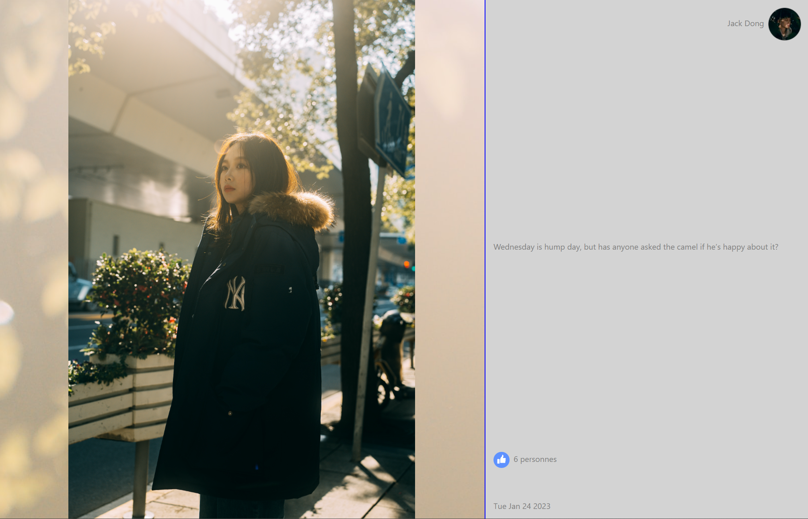
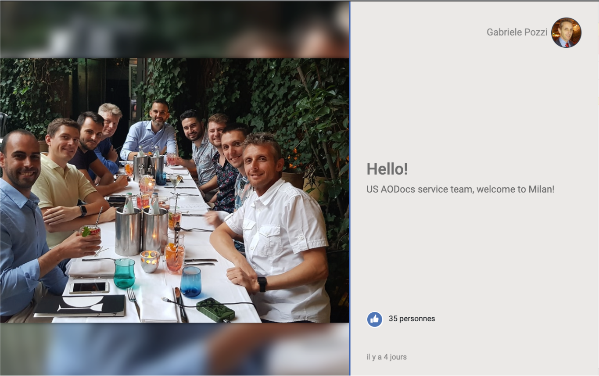

# Oleg - Frontend - Talarian's tech test

Demo: https://olegsuv-react-photo-slider.netlify.app/

# Task

### Objective:
Given an Open API specification and a visual example, develop a standalone app that displays images and other information.

### Description:
You want to display beautiful images on screens of different sizes in full screen. 
Each element is displayed for a given amount of time, by default 6 seconds and should contain :
- The full size image
- The user that posted the image’s first name, last name
- The profile image of the user that posted the content
- The date on which the image was posted
- The number of likes for the image
- The post’s title
- The post’s description
